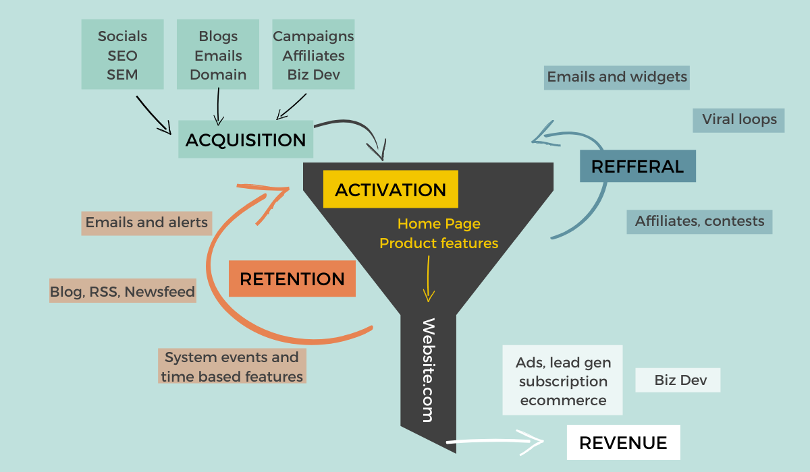

### AARRR

---

#### 과업 → 지표 (과업 기반 지표 관리)  
#### 지표 → 과업 (프레임워크 기반 지표 관리)  
- AARRR은 프레임워크 기반 지표 관리 방식으로 운영됨  

**고객유치**  
- 무료/유료, 식별/미식별  
- 자발적 유입 고객을 늘리고 미식별 유입을 최소화해야 함

**고객 획득 비용** (Customer Acquisition Cost, CAC)  
- 비용 최적화가 필요  

---

#### A (Acquisition) - 사용자 획득

##### 1. UTM 파라미터 (웹)  
- `utm_source`: 어디에서 왔는가?  
- `utm_medium`: 어떤 유형의 링크인가?  
- `utm_campaign`: 어떤 캠페인을 통해 유입되었나?  
- `utm_term`: 어떤 키워드로 검색했는가?  
- `utm_content`: 어떤 콘텐츠를 보고 유입되었는가?  

##### 2. 어트리뷰션 (Attribution) - 모바일  
- 유료 도구로 활용 가능  
- 앱 다운로드를 통해 유입 경로 확인  
- **어트리뷰션 윈도우**: 광고에서 앱 다운로드까지의 기간을 기준으로 판단  
  - **click-through**: 사용자가 광고를 클릭한 후 유입  
  - **view-through**: 광고를 본 후 유입  
  - 여러 어트리뷰션이 동시에 작용할 수 있어 분석이 어려움  

##### 3. 어트리뷰션 모델  
- **원터치 모델**  
  - **first-click**: 첫 클릭에 모든 기여  
  - **last-click**: 마지막 클릭에 모든 기여 (기본값)  
  - 단순하지만 간접 기여를 반영하지 못함  

- **멀티터치 모델**  
  - **linear**: 접점마다 동일한 가중치  
  - **time decay**: 시간 흐름에 따라 가중치 차등 부여  
  - **U-shape**: 첫 번째와 마지막 접점에 높은 가중치  

- 어트리뷰션 기준 설정 시 UTM 파라미터, 어트리뷰션 윈도우 등 고려 필요  

##### 4. 딥링크 / 디퍼드 딥링크  
- **딥링크**: 모바일 앱 내 특정 화면으로 이동하는 링크  
- **디퍼드 딥링크**: 앱 설치 후 지정된 화면으로 이동 (딥링크의 단점을 보완)  

##### 5. 고객 유치 시 주의사항  
- 새로운 채널 테스트에 과도한 리소스를 투입하지 말 것  
- 채널 확장은 예산이 아니라 **채널 포화도**에 따라 결정  
- 오가닉(organic)과 미식별(unknown) 트래픽을 혼동하지 않아야 함  

---

#### A (Activation) - 사용자 활동

- **퍼널 분석**이 핵심  
1. 사용자에게 핵심 가치를 제공하는 **경험 단계**를 명확히 정의해야 함  
2. 단계별 전환율을 적절한 기준으로 측정해야 함  
3. 코호트별 전환율을 주기적으로 분석할 필요가 있음  

##### 전환율 측정 기준  
- **트래픽 기준**: 특정 페이지에서 다음 단계로 넘어가는 비율 (장바구니 → 결제)  
- **사용자 기준**: 목표 행동(구매, 회원가입 등) 완료 비율  

- **선행지표**를 파악해 전환율 개선의 기회를 찾아야 함  

##### 전환율 개선 방법  
- 개인화, UI/UX 개선, 적절한 개입(CRM)  
- 불필요한 단계 수를 줄여 퍼널 효율화  

---

#### R (Retention) - 사용자 유지

- 반복적으로 의미 있는 행동(서비스 재이용, 구매, 시청)을 유도해야 함  
- AARRR 단계 중 가장 개선이 어려운 부분이며 **리텐션은 날짜 기반으로 측정**  

##### 리텐션 측정 방법  
1. **클래식 리텐션**: 특정일에 이벤트를 발생시킨 유저 비율 (Day N 리텐션)  
2. **범위 리텐션**: 특정 기간 동안 이벤트 발생 비율 (7일, 30일 등)  
3. **롤링 리텐션**: 더 이상 이벤트가 발생하지 않은 비율을 측정  
   - 초기 및 마지막 로그인만으로 분석 가능해 간단함  
   - 서비스 이용 빈도가 낮은 경우에 적합 (예: 여행)  

##### 인게이지먼트 측정  
- **DAU**(Daily Active User) / **MAU**(Monthly Active User) 활용  

##### 리텐션 분석 시 고려사항  
- 시간에 따른 변화 추이를 면밀히 관찰  
- 초기 리텐션 하락 속도를 줄이고, 안정화 후 장기적으로 유지  

---

#### R (Revenue) - 사용자 매출

##### 주요 수익 지표  
- **ARPU** (Average Revenue Per User): 인당 평균 매출  
  - 특정 기간 동안의 평균 매출을 의미함  
- **ARPDAU**: 일 매출 / DAU  
- **ARPPU** (Average Revenue Per Paying User): 결제자 인당 평균 매출  
- **LTV** (Lifetime Value): 고객 생애 가치 (계산 어려움)  
- **LTR** (Lifetime Revenue): 고객 생애 매출  

##### 수익화 분석  
- 코호트별 LTR과 **CAC의 관계**가 중요  
  - CAC + α < LTR이어야 함 (LTR은 CAC의 5~10배 수준이 이상적)  
- **MRR** (Monthly Recurring Revenue) 분석  
  - **기준 MMR**: 전월 매출  
  - **신규 MMR**: 신규 고객 매출  
  - **이탈 MMR**: 이탈 고객으로 인한 매출 감소  
  - **업그레이드 MMR**: 크로스셀, 업셀 매출 증가  
  - **다운그레이드 MMR**: 요금제 하향 조정으로 인한 매출 감소  

---

#### R (Referral) - 사용자 추천

- 추천 과정은 초대 맥락, 메시지/보상, 온보딩 프로세스와 연결됨  

##### 바이럴 계수 (Viral Coefficient)  
- 바이럴 계수 = 사용자 수 × 초대 비율 × 인당 초대한 친구 수 × 전환율 / 사용자 수  

---

#### 주요 지표 요약

| AARRR            | Acquisition 사용자 획득           | Activation 사용자 활동         | Retention 사용자 유지           | Referral 사용자 추천            | Revenue 사용자 매출            |
|------------------|-----------------------------------|--------------------------------|--------------------------------|--------------------------------|--------------------------------|
| 유입 경로 분석    | 유저 환경/유저 획득 분석            | 사용 형태 분석                  | Engagement 분석                 | 추천 분석                       | 매출 분석                       |
| Impression / Click | Download / User Session         | Duration / Frequency / Page (Basket, Sign up) | Retention / Cohort            | SNS / Viral                   | Revenue / Product              |
| CTR, CPM, CPC, CPI, CPE, CPA, CPS | PV, 세션당 단가, 세션 시간, 세션별 페이지뷰, CAC, DAU/WAU/MAU, New / Return | Funnel, Bounce Rate, Exit Rate, RFM | N-day retention, Unbounded retention, Churn rate, Active / inactive | SNS Share Rate, Viral Coefficient, NPS | PU, ARPU, ARPDAU, ARPPU, LTV, ROAS, ROI, 매출, 객단가, 건단가, 구매건수 | 